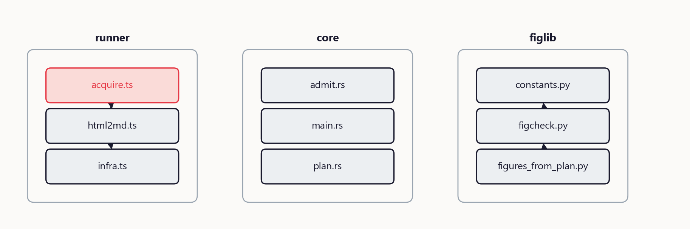
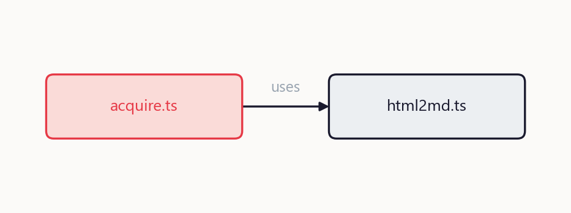
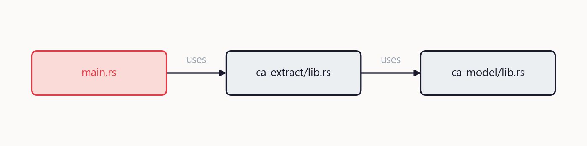
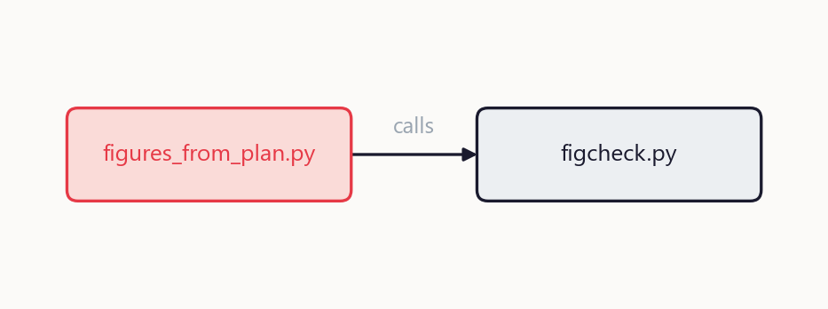
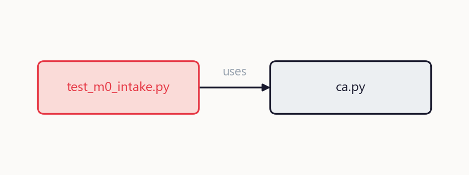

# cookbook-anything: a guided cookbook

## TL;DR

This is a tour of cookbook-anything, compiled from its own source into a model of 68 files and 204 functions, every sentence below traceable to a span. Each chapter takes one area, shows the problem it solves, and walks a real path through the code, so by the end you can change it yourself.



*Figure: the layers of cookbook-anything. Each cluster is a box; the chapters that follow open them up one at a time.*

## Introduction

Read it like this: the source is compiled into a model, and every sentence here is pinned to a span in that model. In the project's own words:

Deterministic code establishes ground truth; the LLM does judgment on top. It is a **compiler with two firewalls**. For each planned figure: declare the Figure Read, pull the payload from the model (provenance-checked), pick the recipe, render, run `figcheck.py`, then the critic inspects the actual rendered image and either passes it or cites rule IDs. 

Read the chapters in order; each assumes only what came before. Use the cookbook at the end to turn the tour into commands.

Chapter map:

- Chapter 1: runner
- Chapter 2: core
- Chapter 3: figlib
- Chapter 4: tests

## Chapter 1: runner

See why this area exists, in the project's own words:

Exit condition: every fetched item has an archive copy, an audit entry, and (for media) a license record; zero robots.txt violations; budgets respected. The part that keeps it honest is not the swarm at all, it is the single admission gate: workers propose, ca admit re-verifies every span reference, so a sloppy worker can only waste its own time. See `DESIGN.md` for the full spec and milestone gates (M0..M5), `CLAUDE.md` for the operating guide, and `quality_reports/` for the audit trail of every session. 

At the center of `runner` is `acquire.ts`: defines `Ctx`, `archivePage`, `arg`.

Follow one real path through runner: start at `acquire.ts`, which reaches into `html2md.ts`.



*Figure: the path from `acquire.ts` to `html2md.ts`. Each box hands off to the next, so changing one tells you exactly what downstream it can touch.*

The pieces that matter here:

- `acquire.ts`: defines `Ctx`, `archivePage`, `arg`
- `html2md.ts`: defines `decodeEntities`, `htmlToMarkdown`
- `infra.ts`: defines `Audit`, `Budget`, `HttpCache`
- `license.ts`: defines `CommonsMeta`, `GateVerdict`, `LicenseRecord`
- `robots.ts`: defines `RobotsRules`, `isAllowed`, `parseRobots`

What you can now do: open `acquire.ts` and follow the calls above to see how `runner` does its job end to end.

## Chapter 2: core

See why this area exists, in the project's own words:

Exit condition: model.json validates; 100% of edges have extractors; 100% of claims have spans; zero unresolved dangling references. Exit condition: a manifest where every source has a parser, a hash, and a trace; zero secrets in any span (verified by a planted-secret test, M0). Secret hygiene: `intake.py` strips API keys, tokens, passwords, and high-entropy strings *before* anything reaches spans, and logs what it redacted (count and kind, never the value). 

At the center of `core` is `ca-model/lib.rs`: defines `Asset`, `Claim`, `ClaimStatus`.

Follow one real path through core: start at `main.rs`, which reaches into `ca-extract/lib.rs`, which reaches into `ca-model/lib.rs`.



*Figure: the path from `main.rs` to `ca-model/lib.rs`. Each box hands off to the next, so changing one tells you exactly what downstream it can touch.*

The pieces that matter here:

- `ca-model/lib.rs`: defines `Asset`, `Claim`, `ClaimStatus`
- `main.rs`: defines `cmd_admit`, `cmd_compile`, `cmd_grade`
- `plan.rs`: defines `Chapter`, `FigurePlan`, `Plan`
- `write.rs`: defines `WriteOut`, `coverage_json`, `mint`
- `ca-extract/lib.rs`: defines `ExtractOut`, `add_span`, `default`

What you can now do: open `main.rs` and follow the calls above to see how `core` does its job end to end.

## Chapter 3: figlib

See why this area exists, in the project's own words:

Exit condition: every figure passes figcheck with zero P0/P1; payload provenance verifies; every figure referenced from prose with a takeaway caption. The **fetch ladder** (cheapest first, escalate only on failure): (1) static HTTP fetch rendered to clean markdown; (2) headless render for JS-heavy pages (also produces screenshots); (3) vision-guided browsing only when structure fails and only within budget. Screenshots are citation evidence, not decoration: browser-chrome frame stamped with URL and access date, minimal size, source always carried. 

At the center of `figlib` is `style.py`: the house style.

Follow one real path through figlib: start at `figures_from_plan.py`, which reaches into `figcheck.py`.



*Figure: the path from `figures_from_plan.py` to `figcheck.py`. Each box hands off to the next, so changing one tells you exactly what downstream it can touch.*

The pieces that matter here:

- `style.py`: the house style
- `render.py`: render one FigurePayload through its recipe
- `figures_from_plan.py`: build FigurePayloads from plan.json + model.json
- `introspect.py`: facts about a rendered figure, taken from the live artist
- `payload.py`: the figure data contract (DESIGN 5.4)

What you can now do: open `figures_from_plan.py` and follow the calls above to see how `figlib` does its job end to end.

## Chapter 4: tests

See why this area exists, in the project's own words:

Assemble `paper.md` (anatomy §7), render figures at final resolution, run `grade.py`; ship only at or above the gate. The paper is a view over the compiled model. Public domain/CC0: free, provenance recorded. 

At the center of `tests` is `ca.py`: locate and invoke the ca binary (the Rust core CLI).

Follow one real path through tests: start at `test_m0_intake.py`, which reaches into `ca.py`.



*Figure: the path from `test_m0_intake.py` to `ca.py`. Each box hands off to the next, so changing one tells you exactly what downstream it can touch.*

The pieces that matter here:

- `ca.py`: locate and invoke the ca binary (the Rust core CLI)
- `test_m0_intake.py`: 3 source types parse with traces; 12 planted secrets -> 0 leaks
- `test_m1_compile.py`: on a real mid-size repo (llmwiki, ~104 py + 9 sql
- `test_m25_acquire.py`: autonomous acquisition, license-gated
- `test_m3_write.py`: plan + write with the leash on

What you can now do: open `test_m0_intake.py` and follow the calls above to see how `tests` does its job end to end.

## The cookbook

Concrete tasks, each traced to the files you touch.

### 1. Run it on a codebase

```
node --experimental-strip-types runner/stages.ts <sources-dir> <workspace> <name>
```
Edit: nothing. Run: `runner/stages.ts`. Expected: a graded paper at `<workspace>/out/paper.md` with figures. Verified by: `tests/test_m4_ship.py`.

### 2. Add a figure recipe

1. Create `figlib/recipes/yourrecipe.py` with a `render(payload, model)` function, modeled on `figlib/recipes/quantity.py`.
2. Register it in `figlib/recipes/__init__.py` (the `registry()` map) and add its ceiling to `CEILINGS`.
3. Expected: `python figlib/figcheck.py` passes your figure with provenance resolving to the model.
4. Verified by: `tests/test_m2_figures.py` (the seeded-defect critic must stay at 10/10).

## Glossary

- **Archive-on-fetch**: every fetched page stored as markdown plus a rendered (span:d00027)
- **The license gate**: an external image enters the model only with a verified (span:d00029)
- **ExtractOut**: Accumulator passed through extractors. (span:r00168)
- **PdfPages**: their own spans (locator "book.pdf#p3"). (span:r00179)
- **FigureContext**: Apply a mode (print or sketch) for the duration of one render. (span:c00322)

## Claims appendix

- `c:0001` "Deterministic code establishes ground truth; the LLM does judgment on top." -> CLAUDE.md#L5-L9
- `c:0002` "The name says the contract: hand it anything, get a cookbook back." -> DESIGN.md#L7-L10
- `c:0003` "It is a **compiler with two firewalls**." -> DESIGN.md#L16-L27
- `c:0004` "Each has a deterministic floor (scripts) and a judgment layer (agents) and a checkable exit condition." -> DESIGN.md#L66-L68
- `c:0005` "One JSON document (sharded by kind on disk once large), with six record types." -> DESIGN.md#L115-L117
- `c:0006` "Secret hygiene: `intake.py` strips API keys, tokens, passwords, and high-entropy strings *before* anything reaches spans, and logs what it redacted (count and kind, never the value)." -> DESIGN.md#L206-L211
- `c:0007` "Every stage prints progress (`[Stage N/7] name...`, batch counters, one-line completion summaries)." -> DESIGN.md#L217-L218
- `c:0008` "Budget caps per run (pages, megabytes, minutes)." -> DESIGN.md#L227-L231
- `c:0009` "The **fetch ladder** (cheapest first, escalate only on failure): (1) static HTTP fetch rendered to clean markdown; (2) headless render for JS-heavy pages (also produces screenshots); (3) vision-guided browsing only when structure fails and only within budget." -> DESIGN.md#L233-L237
- `c:0010` "Web spans point at the archived copy, never the live URL alone." -> DESIGN.md#L240-L241
- `c:0011` "Public domain/CC0: free, provenance recorded." -> DESIGN.md#L244-L249
- `c:0012` "Screenshots are citation evidence, not decoration: browser-chrome frame stamped with URL and access date, minimal size, source always carried." -> DESIGN.md#L251-L252
- `c:0013` "Hard limits: no login walls, no paywall or CAPTCHA circumvention, no fetching off the allowlist." -> DESIGN.md#L254-L256
- `c:0014` "Exit condition: every fetched item has an archive copy, an audit entry, and (for media) a license record; zero robots.txt violations; budgets respected." -> DESIGN.md#L258-L259
- `c:0015` "The trace is what makes a wrong paper debuggable." -> DESIGN.md#L263-L266
- `c:0016` "Exit condition: a manifest where every source has a parser, a hash, and a trace; zero secrets in any span (verified by a planted-secret test, M0)." -> DESIGN.md#L268-L269
- `c:0017` "Exit condition: model.json validates; 100% of edges have extractors; 100% of claims have spans; zero unresolved dangling references." -> DESIGN.md#L283-L284
- `c:0018` "Exit condition: every chapter lists its node IDs, figure plan, prerequisite chapters; the prerequisite graph is acyclic." -> DESIGN.md#L294-L295
- `c:0019` "The list lives in `lint_prose.py`." -> DESIGN.md#L311-L315
- `c:0020` "Exit condition: claim coverage >= 95% of factual sentences; zero P0 prose lints; humanize pass complete with an inspectable diff." -> DESIGN.md#L317-L318
- `c:0021` "For each planned figure: declare the Figure Read, pull the payload from the model (provenance-checked), pick the recipe, render, run `figcheck.py`, then the critic inspects the actual rendered image and either passes it or cites rule IDs." -> DESIGN.md#L322-L325
- `c:0022` "Exit condition: every figure passes figcheck with zero P0/P1; payload provenance verifies; every figure referenced from prose with a takeaway caption." -> DESIGN.md#L327-L329
- `c:0023` "Assemble `paper.md` (anatomy §7), render figures at final resolution, run `grade.py`; ship only at or above the gate." -> DESIGN.md#L333-L336
- `c:0024` "The critic checks the rendered figure against its declared read." -> DESIGN.md#L369-L374
- `c:0025` "Anti-default discipline: no default color cycle, no jet/rainbow (viridis only for true continuous fields), no `figsize=(6.4, 4.8)` reflex, no title restating the caption, no 3D unless data is 3D, no pie charts, no dual y-axes." -> DESIGN.md#L376-L378
- `c:0026` "Every recipe enforces the **one-idea rule**: one point per figure, stated in the caption." -> DESIGN.md#L397-L398
- `c:0027` "A recipe's payload may contain **only**: model node IDs, model edge references, span-backed quantities, layout hints." -> DESIGN.md#L402-L407
- `c:0028` "Loop per figure: render → figcheck (mechanical) → critic on the PNG (visual) → fixes → re-render." -> DESIGN.md#L428-L429
- `c:0029` "Gates: **80 ships with warnings listed; 90 is the target; below 80 does not ship.** A red grade cannot be pushed or delivered silently." -> DESIGN.md#L484-L485
- `c:0030` "Append-only `[LEARN:tag]` entries." -> MEMORY.md#L3-L4
- `c:0031` "The score must come from assess.py before any push; opinion-based "looks done" is how slop ships." -> MEMORY.md#L6-L8
- `c:0032` "Push auth to github.com/sndsh404 works." -> MEMORY.md#L10-L13
- `c:0033` "Planted secrets must be assembled at runtime (string joins) so they exist only in the gitignored workspace." -> MEMORY.md#L15-L15
- `c:0034` "Encoding invariants in types beats enforcing them in pipelines." -> MEMORY.md#L19-L19
- `c:0035` "Wall-time gates are won in startup costs." -> MEMORY.md#L23-L23
- `c:0036` "Status filters on claim queries are load-bearing, not cosmetic." -> MEMORY.md#L25-L25
- `c:0037` "The part that keeps it honest is not the swarm at all, it is the single admission gate: workers propose, ca admit re-verifies every span reference, so a sloppy worker can only waste its own time." -> MEMORY.md#L27-L27
- `c:0038` "Give timing metrics a small tolerance band in the harness and keep the hard threshold in the gate test itself." -> MEMORY.md#L29-L29
- `c:0039` "Point it at anything: a codebase, a database dump, a folder of PDFs, a book." -> README.md#L3-L5
- `c:0040` "The paper is a view over the compiled model." -> README.md#L21-L22
- `c:0041` "Each has a deterministic floor (scripts), a judgment layer (agents), and a checkable exit condition." -> README.md#L30-L32
- `c:0042` "See `DESIGN.md` for the full spec and milestone gates (M0..M5), `CLAUDE.md` for the operating guide, and `quality_reports/` for the audit trail of every session." -> README.md#L63-L65
- `c:0043` "This repo runs on a four-document system plus an objective harness." -> WORKFLOW.md#L3-L4
- `c:0044` "Ten violations planted on purpose." -> figlib/seeded_defects/prose_slop.md#L3-L4
- `c:0045` "We leverage the buffer pool to deliver a seamless experience." -> figlib/seeded_defects/prose_slop.md#L8-L10
- `c:0046` "The cache sits between the executor and the disk — every request passes through it." -> figlib/seeded_defects/prose_slop.md#L14-L15
- `c:0047` "This paragraph is plain text where the takeaway caption should have been." -> figlib/seeded_defects/prose_slop.md#L21-L21
- `c:0048` "The model is one JSON document." -> figlib/seeded_defects/prose_slop.md#L34-L34
- `c:0049` "Also: 3 source types (git repo, PDF, mixed folder) parse with per-source trace timelines; rerun on unchanged sources reparses 0 (sha256 manifest check)." -> quality_reports/checkpoints/2026-06-11-m0-intake.md#L7-L9
- `c:0050` "METRIC secrets_leaked=0, m0_sources_parsed=3, m0_rerun_reparsed=0." -> quality_reports/checkpoints/2026-06-11-m0-intake.md#L32-L33
- `c:0051` "On llmwiki-master (real repo, 104 py + 9 sql files): 100% of 2172 edges carry extractors; 100% of 16 claims carry spans; 0 dangling edges after merge; planted agent-proposed edge clamped to 0.75 by merge.py." -> quality_reports/checkpoints/2026-06-11-m1-compile.md#L7-L10
- `c:0052` "METRIC m1_edges_extractor_pct=100, m1_claims_span_pct=100, m1_danglers=0, m1_agent_edge_clamped=1." -> quality_reports/checkpoints/2026-06-11-m1-compile.md#L40-L41
- `c:0053` "Critic caught 10/10 seeded defects citing the correct rule IDs (gate >= 9)." -> quality_reports/checkpoints/2026-06-12-m2-figures.md#L7-L10
- `c:0054` "First run on real data: F-03 (annotation column overlapping long code lines in annotated_code) and F-04 (grid color missing from the allowed set)." -> quality_reports/checkpoints/2026-06-12-m2-figures.md#L40-L44
- `c:0055` "METRIC m2_seeded_defects_caught=10, m2_recipe_violations=0, m2_recipes_rendered=7." -> quality_reports/checkpoints/2026-06-12-m2-figures.md#L48-L49
- `c:0056` "METRIC m25_robots_violations=0, m25_offsite_denied=1, m25_pages_archived=50, m25_rerun_fetches=0, m25_license_verified=1 (live api), m25_mismatch_rejected=1, m25_arr_rejected=1, m25_screenshot_framed=1." -> quality_reports/checkpoints/2026-06-12-m25-acquire.md#L45-L48
- `c:0057` "Chapter prerequisite graph acyclic (prereqs may only point backwards by construction; forward deps counted and dropped honestly)." -> quality_reports/checkpoints/2026-06-12-m3-write.md#L7-L12
- `c:0058` "METRIC m3_chapter_graph_acyclic=1, m3_claim_coverage=100, m3_planted_flagged=1, m3_banned_words=0, m3_emdashes=0, m3_prose_defects_caught=10." -> quality_reports/checkpoints/2026-06-12-m3-write.md#L53-L55
- `c:0059` "Full pipeline (stages.ts: intake -> compile -> topology -> plan -> write -> verify -> figures -> lint -> grade) on llmwiki ships at **grade 99/100** (gate >= 80), zero P0, page-one figure present, all 4 chapters figured, claims + unverified appendices emitted." -> quality_reports/checkpoints/2026-06-12-m4-ship.md#L7-L11
- `c:0060` "That is DESIGN v2 ("every real complaint becomes a named, checkable rule") happening in v0." -> quality_reports/checkpoints/2026-06-12-m4-ship.md#L27-L30
- `c:0061` "METRIC m4_grade=99, m4_chapters_figured=4, m4_figure_p0=0." -> quality_reports/checkpoints/2026-06-12-m4-ship.md#L34-L35
- `c:0062` "A one-file change (README edit) re-ships the paper at **16.3% of full-run work** (800ms vs 4919ms, stage timings in .cookbook/timings.json; gate < 20%)." -> quality_reports/checkpoints/2026-06-12-m5-incremental.md#L7-L12
- `c:0063` "The writer quoted a superseded claim whose span text had changed under it; the verifier flagged it as a broken marker." -> quality_reports/checkpoints/2026-06-12-m5-incremental.md#L33-L35
- `c:0064` "METRIC m5_rerun_work_pct=16.3, m5_supersession_linked=1, m5_history_chain_len=3." -> quality_reports/checkpoints/2026-06-12-m5-incremental.md#L46-L47
- `c:0065` "Independent support raises a claim's confidence (0.6 -> 0.7 with a second span); a span-backed contradiction mints a second claim and an event in runs.jsonl while the original stays active." -> quality_reports/checkpoints/2026-06-12-m6-swarm.md#L7-L13
- `c:0066` "METRIC m6_chapters_covered=6, m6_claims_admitted=9, m6_rejected_unsourced=2, m6_unsourced_admitted=0, m6_support_confidence_raised=1, m6_contradiction_recorded=1." -> quality_reports/checkpoints/2026-06-12-m6-swarm.md#L56-L59
- `c:0067` "Reviewer: Sandesh (stand-in during autonomous session)." -> quality_reports/issues/2026-06-12-paper-review.md#L3-L4
- `c:0068` "Chapters 1-3 all carry "*Figure: few internal edges; sizes orient the reader faster here*", which is the planner's internal `why`, not a takeaway, and it repeats verbatim." -> quality_reports/issues/2026-06-12-paper-review.md#L17-L21
- `c:0069` "The planner should fold clusters below ~3 files into a "supporting" chapter." -> quality_reports/issues/2026-06-12-paper-review.md#L38-L40
- `c:0070` "One autonomous session, all milestones M0 through M5 shipped green." -> quality_reports/session_logs/2026-06-12-session-1.md#L3-L3
- `c:0071` "Final assess: 100/100 green, no regressions." -> quality_reports/session_logs/2026-06-12-session-1.md#L17-L18
- `c:0072` "Open items for the next session: planner folding of thin chapters (filed issue 5), the LLM vision critic on rendered PNGs (the judgment layer the seeded-defect gate was built to calibrate), playwright as fetch ladder rung 2, and the docx export." -> quality_reports/session_logs/2026-06-12-session-1.md#L26-L29
- `c:w0001` "This is a tour of cookbook-anything, compiled from its own source into a model of 68 files and 204 functions, every sentence below traceable to a span." -> figlib/figures_from_plan.py
- `c:w0002` "Each chapter takes one area, shows the problem it solves, and walks a real path through the code, so by the end you can change it yourself." -> figlib/figures_from_plan.py
- `c:w0003` "At the center of `runner` is `acquire.ts`: defines `Ctx`, `archivePage`, `arg`." -> runner/acquire/acquire.ts
- `c:w0004` "Follow one real path through runner: start at `acquire.ts`, which reaches into `html2md.ts`." -> runner/acquire/acquire.ts, runner/acquire/html2md.ts
- `c:w0005` "`acquire.ts`: defines `Ctx`, `archivePage`, `arg`" -> runner/acquire/acquire.ts
- `c:w0006` "`html2md.ts`: defines `decodeEntities`, `htmlToMarkdown`" -> runner/acquire/html2md.ts
- `c:w0007` "`infra.ts`: defines `Audit`, `Budget`, `HttpCache`" -> runner/acquire/infra.ts
- `c:w0008` "`license.ts`: defines `CommonsMeta`, `GateVerdict`, `LicenseRecord`" -> runner/acquire/license.ts
- `c:w0009` "`robots.ts`: defines `RobotsRules`, `isAllowed`, `parseRobots`" -> runner/acquire/robots.ts
- `c:w0010` "At the center of `core` is `ca-model/lib.rs`: defines `Asset`, `Claim`, `ClaimStatus`." -> core/ca-model/src/lib.rs
- `c:w0011` "Follow one real path through core: start at `main.rs`, which reaches into `ca-extract/lib.rs`, which reaches into `ca-model/lib.rs`." -> core/ca-cli/src/main.rs, core/ca-extract/src/lib.rs, core/ca-model/src/lib.rs
- `c:w0012` "`ca-model/lib.rs`: defines `Asset`, `Claim`, `ClaimStatus`" -> core/ca-model/src/lib.rs
- `c:w0013` "`main.rs`: defines `cmd_admit`, `cmd_compile`, `cmd_grade`" -> core/ca-cli/src/main.rs
- `c:w0014` "`plan.rs`: defines `Chapter`, `FigurePlan`, `Plan`" -> core/ca-cli/src/plan.rs
- `c:w0015` "`write.rs`: defines `WriteOut`, `coverage_json`, `mint`" -> core/ca-cli/src/write.rs
- `c:w0016` "`ca-extract/lib.rs`: defines `ExtractOut`, `add_span`, `default`" -> core/ca-extract/src/lib.rs
- `c:w0017` "At the center of `figlib` is `style.py`: the house style." -> figlib/style.py
- `c:w0018` "Follow one real path through figlib: start at `figures_from_plan.py`, which reaches into `figcheck.py`." -> figlib/figures_from_plan.py, figlib/figcheck.py
- `c:w0019` "`style.py`: the house style" -> figlib/style.py
- `c:w0020` "`render.py`: render one FigurePayload through its recipe" -> figlib/render.py
- `c:w0021` "`figures_from_plan.py`: build FigurePayloads from plan.json + model.json" -> figlib/figures_from_plan.py
- `c:w0022` "`introspect.py`: facts about a rendered figure, taken from the live artist" -> figlib/introspect.py
- `c:w0023` "`payload.py`: the figure data contract (DESIGN 5.4)" -> figlib/payload.py
- `c:w0024` "At the center of `tests` is `ca.py`: locate and invoke the ca binary (the Rust core CLI)." -> tests/ca.py
- `c:w0025` "Follow one real path through tests: start at `test_m0_intake.py`, which reaches into `ca.py`." -> tests/test_m0_intake.py, tests/ca.py
- `c:w0026` "`ca.py`: locate and invoke the ca binary (the Rust core CLI)" -> tests/ca.py
- `c:w0027` "`test_m0_intake.py`: 3 source types parse with traces; 12 planted secrets -> 0 leaks" -> tests/test_m0_intake.py
- `c:w0028` "`test_m1_compile.py`: on a real mid-size repo (llmwiki, ~104 py + 9 sql" -> tests/test_m1_compile.py
- `c:w0029` "`test_m25_acquire.py`: autonomous acquisition, license-gated" -> tests/test_m25_acquire.py
- `c:w0030` "`test_m3_write.py`: plan + write with the leash on" -> tests/test_m3_write.py

## Unverified appendix

- no agent-proposed edges in this model
